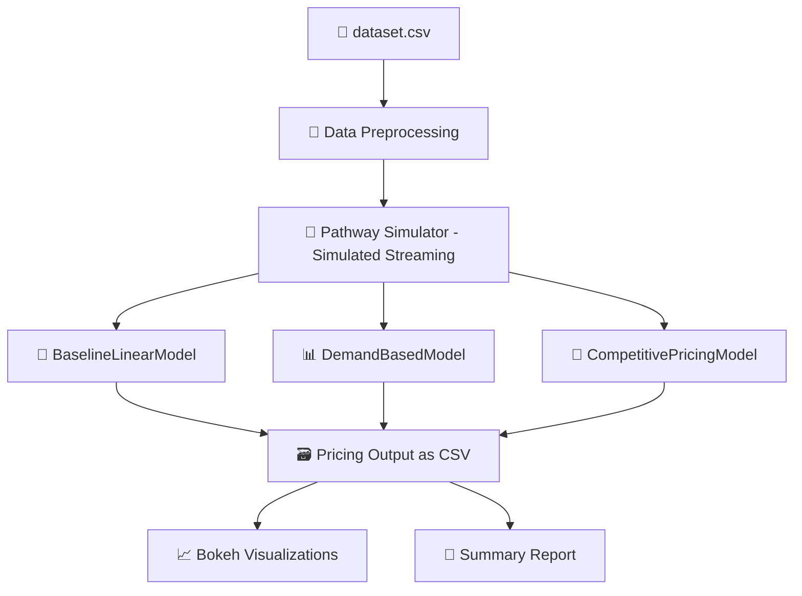

# 🚗 Dynamic Pricing for Urban Parking Lots
### 🎓 *Capstone Project — Summer Analytics 2025*
#### 🧾 Submitted by: Sanket Kishor Jadhav

---

## 📌 Project Overview

This project focuses on building a **Dynamic Pricing System** for urban parking spaces, simulating how prices can be adjusted in real-time based on demand signals such as **occupancy**, **traffic**, **vehicle type**, and **queue length**.

The simulation incorporates **three distinct pricing models** and mimics real-time data flow using a custom `PathwaySimulator`, making it ideal for smart city scenarios.

---

## 🛠 Tech Stack

| Category         | Tools/Libraries                        |
|------------------|----------------------------------------|
| Language         | Python 3.10+                           |
| Data Handling    | pandas, numpy                          |
| Visualization    | Bokeh (interactive plots)              |
| Simulation       | Custom `PathwaySimulator` class        |
| Geospatial Logic | Haversine Formula                      |
| Notebook         | Google Colab / Jupyter                 |

---

## 🧱 Project Architecture



---

## 🔄 Workflow Explanation

### 1. 🧹 **Data Cleaning & Preparation**
- Read CSV data and merge `LastUpdatedDate` + `LastUpdatedTime` into a single `timestamp`
- Normalize values for occupancy, traffic, and queue length
- Fill missing values with defaults (e.g., medium traffic)

### 2. 🔁 **Simulated Real-Time Streaming**
- `PathwaySimulator` streams data in small time-based batches
- Mimics how a real `pathway.replay_csv()` stream would work

### 3. 🧮 **Dynamic Pricing Models**
- **BaselineLinearModel**: Pricing increases linearly with occupancy
- **DemandBasedModel**: Multivariable pricing using queue, traffic, special days
- **CompetitivePricingModel**: Adds geospatial competitor pricing based on proximity

### 4. 📈 **Visualization**
- Interactive plots using Bokeh:
  - Real-time pricing trends
  - Price vs Occupancy
  - Avg price by space (Top 20)
  - Price vs Queue Length

### 5. 💾 **Result Export**
- Prices from all models exported to CSV:
  - `parking_pricing_baseline_results.csv`
  - `parking_pricing_demand_based_results.csv`
  - `parking_pricing_competitive_results.csv`

---

## 📊 Sample Visualizations

| Plot | Description |
|------|-------------|
| 📈 Real-Time Pricing | Shows 5 parking spaces with time-based price evolution |
| 🔄 Price vs Occupancy | Correlation between fill rate and price |
| 🅿️ Top 20 Spaces | Avg price comparison across most active zones |
| 🚦 Queue Impact | How price scales with waiting demand |

---

## 📁 Folder Structure

```
📦 dynamic-parking-pricing/
├── SA25_Project_Final.ipynb               # Final notebook
├── dataset.csv                            # Cleaned parking dataset
├── parking_pricing_baseline_results.csv  # Output: Baseline model
├── parking_pricing_demand_based_results.csv  # Output: Demand-based model  
├── parking_pricing_competitive_results.csv  # Output: Competitive pricing model
├── README.md                              # You're here
```

---

## 🚀 How to Run

1. Clone the repo or upload to Google Colab  
2. Install dependencies:
   ```bash
   !pip install bokeh pathway
   ```
3. Run all cells in `SA25_Project_Final.ipynb`  
4. View results and interact with Bokeh plots

---

## 🙏 Acknowledgements

- Grateful to the **organizers of the Summer Analytics 2025 capstone project** for the opportunity to explore real-world analytics challenges.
- Thanks to the mentors and facilitators for their guidance throughout.

---

## 👨‍💻 Author

### **Sanket Kishor Jadhav**  
**Developer | Data Analyst | AI & ML Enthusiast**

- Lead contributor and architect of this dynamic pricing engine.  
- Focused on designing real-time, data-driven solutions for smart cities and urban optimization.  
- This project was built with a deep emphasis on technical accuracy, simulation rigor, and actionable insights through interactive analytics.
